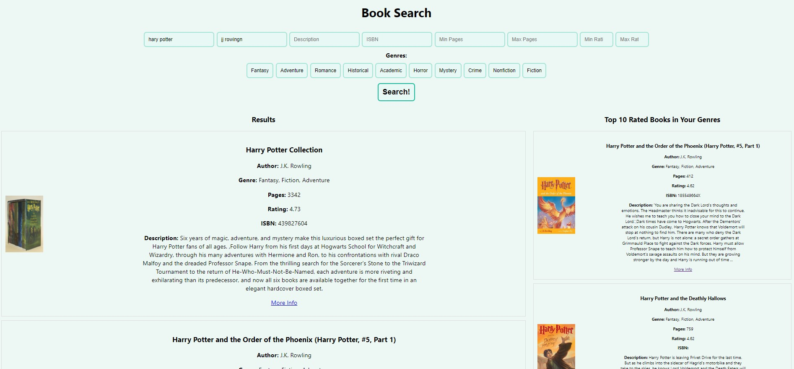
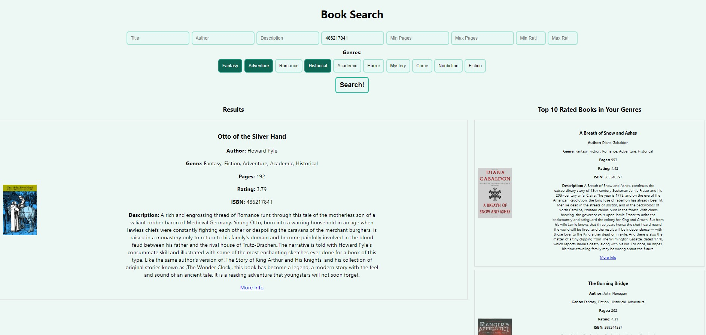
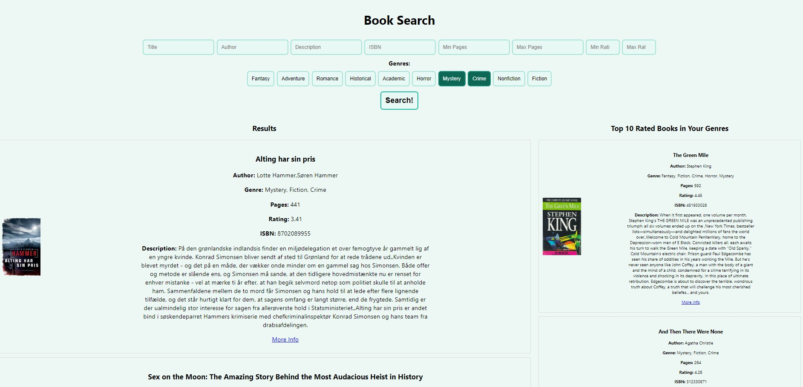

# Project Information

## Dataset
We are working with the [GoodReads 100k books](https://www.kaggle.com/datasets/mdhamani/goodreads-books-100k) dataset
created by Manav Dhamani on Kaggle. We chose this dataset over the others because of its size - 100k is a good
scale to test our system - and completeness. It has very few null values, and also includes columns for genres
and ratings, both attributes that we wanted to build functionality around in our application.

## Technologies

### Application
We were originally considering using a Python library to create an application that the user would interact with.
However, we can't expect people to run our python code on their computer locally --- what if they don't know how to,
or don't have the Python and/or the correct packages installed --- and even if we create an executable, it could
only work on some platforms.

Noting this, we quickly decided to switch to a web based product, and created a website, using React for the frontend
and Flask for the backend. This way, anyone on any platform can easily access our product.
Pairing that with a simple and easily navigatable UI, we were able to meet our "user-friendliness" requirement.

### Search Engine
We went through a similar process for the search and sorting implementations. We initially toyed with the idea
of using Pandas, since it was a library that we were familiar with, and it was designed for the type of queries
that we would be performing. However, we quickly realized that the way Pandas handles complex queries, which
is chaining together simpler queries and continuosly converting the intemediate results to dataframe objects,
is not scalable. Thus, we switched to using Elasticsearch, a popular search engine used in various products
in the industry, checking off our "speed" requirement.

## Screenshots
Title and Author fields allow for typos:

ISBN only returns the exact match:

Top 10 list updates based on the selected genres:

## Conclusion
We used the techniques we discussed in class and combined them with industry standard tools to create Readly,
a super-simple and blazingly-fast book catalogue. Our application is extremely user-friendly and accessable, as
it's hosted on the web, and blazingly-fast and scalable, it's using Elasticsearch for searching and sorting.
